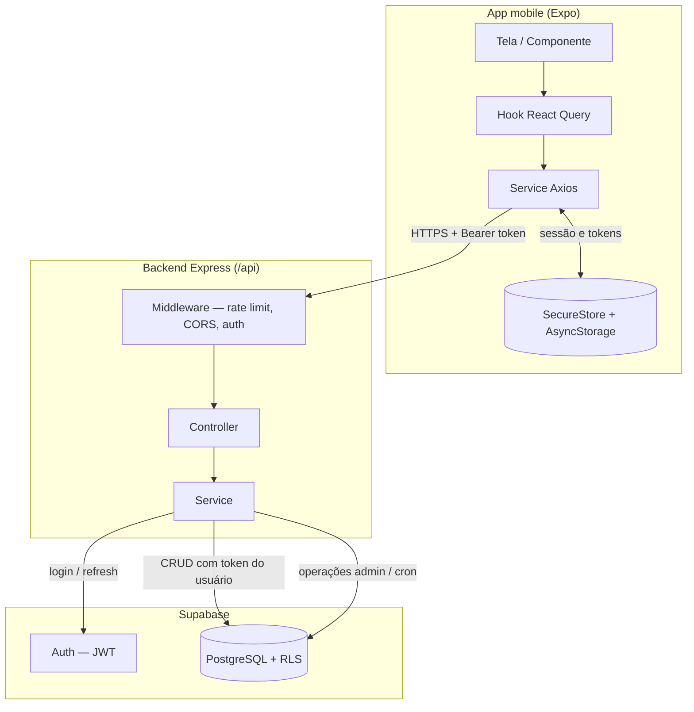
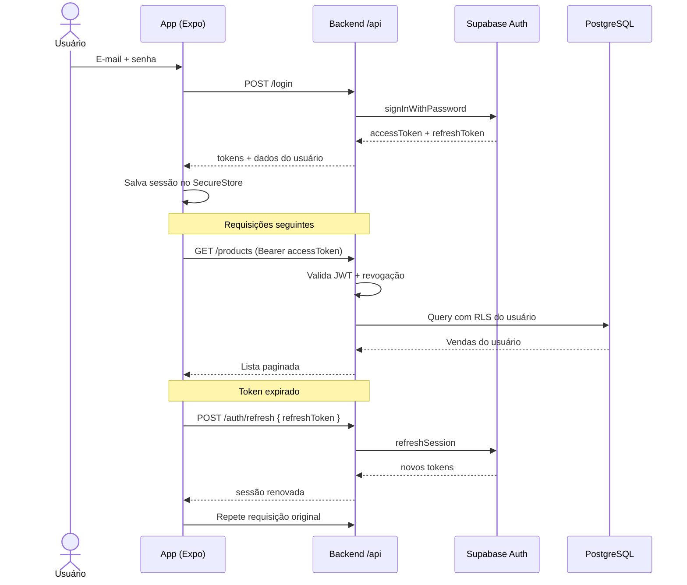
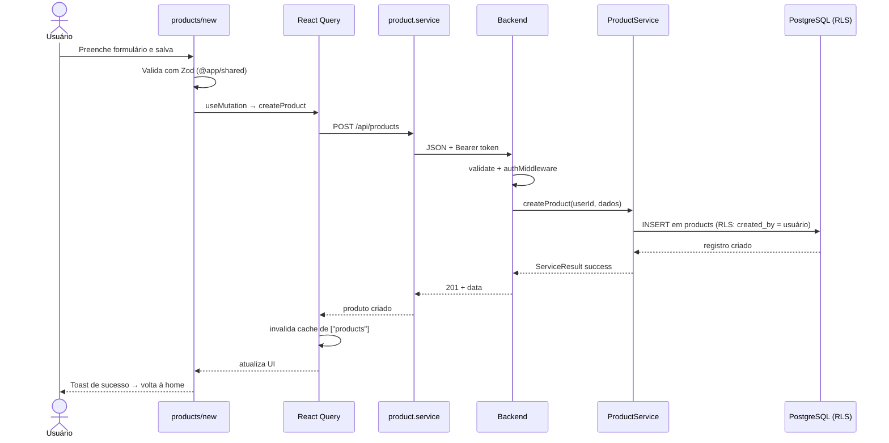
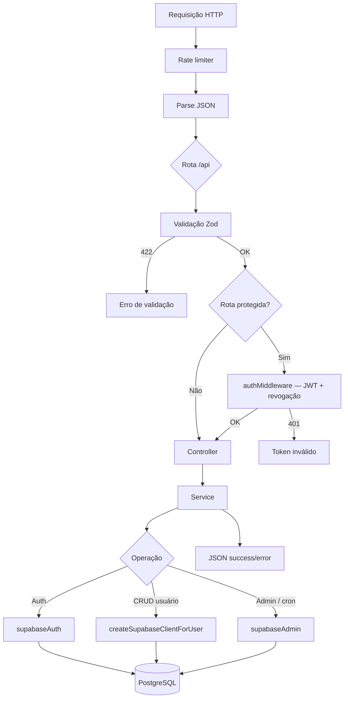
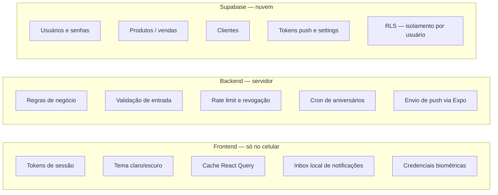
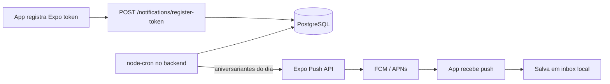

# Sintonia — loja-joias

Aplicativo mobile para **revendedoras de joias** gerenciarem vendas, clientes e finanças em um só lugar. O projeto **Sintonia** (slug `loja-joias`) é um monorepo com app nativo, API REST e banco de dados na nuvem.

---

## Sobre o projeto

O Sintonia foi pensado para quem vende joias de forma independente e precisa de um controle prático no celular: registrar o que foi vendido, para quem, quanto entrou e o que ainda está em aberto. Em vez de planilhas ou anotações soltas, o app centraliza o catálogo de peças, o cadastro de clientes e indicadores financeiros.

Principais funcionalidades:

- **Vendas** — Cadastro de vendas com tipo de joia (colares, pulseiras, brincos, anéis etc.), valor, status de pagamento e vínculo com o cliente.
- **Clientes** — Lista com busca, cadastro com data de nascimento e histórico por cliente.
- **Controle financeiro** — Acompanhamento de pagamentos, totais e valores pendentes na home, com filtros por mês, ano e status.
- **Analytics** — Dashboard com KPIs, gráficos e percentual de ganho configurável no perfil.
- **Notificações** — Lembretes push de aniversário de clientes (cron no backend + Expo Push).
- **Conta e segurança** — Login com e-mail/senha, biometria (Face ID / impressão digital), troca de senha no perfil e recuperação manual via suporte.

---

## Arquitetura

```text
┌─────────────────┐     HTTPS      ┌──────────────────┐     Supabase     ┌─────────────┐
│  App mobile     │ ──────────────▶│  Backend Express │ ────────────────▶│ PostgreSQL  │
│  Expo / RN      │   /api         │  Node.js + TS    │   Auth + RLS     │ + Auth      │
└─────────────────┘                └──────────────────┘                  └─────────────┘
        │                                    │
        │ Expo Push                          │ Redis (opcional)
        ▼                                    ▼ rate limit / revogação
   FCM / APNs                          Render (produção)
```

| Camada | Tecnologia |
|--------|------------|
| **App** | Expo SDK 54, React Native 0.81, Expo Router, TanStack React Query, React Hook Form, Zod, Axios |
| **Backend** | Express 5, TypeScript, Supabase JS, node-cron, Swagger |
| **Banco** | Supabase (PostgreSQL + Auth + RLS) |
| **Compartilhado** | Pacote `@app/shared` — schemas Zod usados no app e na API |
| **Deploy** | EAS Build (app), Render (API `financeiro-api`) |

O app é o único cliente da API. Toda persistência de negócio fica no servidor; o celular guarda sessão (SecureStore), preferências de UI e inbox local de notificações.

---

## Fluxo de funcionamento

O app **nunca acessa o banco diretamente**. Toda comunicação passa pela API Express, que orquestra autenticação, regras de negócio e consultas ao Supabase.

### Visão geral da conexão



| Etapa | Onde acontece | O que ocorre |
|-------|---------------|--------------|
| 1 | **App** | Usuário interage com a tela; hook dispara requisição via service |
| 2 | **App → Backend** | Axios envia `HTTPS` para `/api` com `Authorization: Bearer <token>` |
| 3 | **Backend** | Valida payload (Zod), verifica JWT e aplica rate limit |
| 4 | **Backend → Supabase** | Service consulta Auth ou PostgreSQL conforme a operação |
| 5 | **Supabase → Backend** | Retorna dados; RLS garante que cada usuário vê só o que é dele |
| 6 | **Backend → App** | JSON padronizado (`success`, `data`, `message`) |
| 7 | **App** | React Query atualiza cache; tela re-renderiza |

### Fluxo de autenticação



No boot do app, a sessão é restaurada do **SecureStore**. Se o access token expirou, o `refreshService` renova automaticamente antes de liberar as chamadas à API.

### Fluxo de uma operação de negócio (ex.: nova venda)



O mesmo padrão vale para **clientes**, **perfil**, **analytics** e **notificações**: tela → hook → service → API → service do backend → Supabase.

### Pipeline de uma requisição no backend



### O que fica em cada camada



| Dado | Onde persiste |
|------|---------------|
| Vendas, clientes, perfil | PostgreSQL (via backend) |
| Senhas | Supabase Auth (nunca no app) |
| Access / refresh token | SecureStore no app |
| Push token | Backend + AsyncStorage local |
| Notificações recebidas | AsyncStorage (inbox local) |

### Fluxo de notificações push (paralelo)



O cron roda **no mesmo processo** do backend, consulta clientes com aniversário na data atual e dispara push para os tokens registrados.

---

## Estrutura do monorepo

```text
loja-joias/
├── app/                 # Aplicativo mobile (Expo / React Native)
├── backend/             # API REST Express + TypeScript
├── packages/shared/     # Schemas e tipos compartilhados (@app/shared)
├── supabase/            # Migrations e configuração do banco
└── docs/                # Documentação técnica detalhada
```

---

## Módulos principais

### App (Sintonia)

- **Home** — Lista paginada de vendas agrupadas por status de pagamento, com filtros e atalho para nova venda.
- **Clientes** — CRUD completo com busca e data de nascimento (base para lembretes de aniversário).
- **Produtos / vendas** — Criação, detalhe, edição e exclusão de registros de venda.
- **Analytics** — Métricas e gráficos a partir de `GET /products/analytics`.
- **Perfil** — Nome, tema claro/escuro, biometria, lembretes de aniversário, alterar senha e logout.
- **Notificações** — Tela de inbox local + integração com push server-side.

### Backend (API `/api`)

- **Autenticação** — Registro, login, refresh, logout e fluxo de recuperação de senha via suporte.
- **Perfil** — Dados do usuário, troca de senha e percentual de ganho.
- **Produtos** — CRUD de vendas, filtros, metadados e analytics.
- **Clientes** — CRUD com regras de negócio (ex.: telefone único por usuário).
- **Notificações** — Registro de push token, preferências e cron de aniversários.

---

## Como executar

Requisitos: **Node.js 22.x** (raiz) e **Node.js ≥ 20** (backend).

```bash
# Instalar dependências (raiz do monorepo)
npm install

# Backend — desenvolvimento
cd backend
cp .env.example .env   # configurar variáveis Supabase
npm run dev            # http://localhost:3001

# App — desenvolvimento
cd app
npm start              # Expo Dev Server
```

Variáveis de ambiente do backend incluem `SUPABASE_URL`, `SUPABASE_ANON_KEY`, `SUPABASE_SERVICE_ROLE_KEY` e `SUPABASE_JWT_SECRET`. O app usa URL da API gerada em `app/src/config/api-url.generated.ts`.

---

## Documentação

Documentação técnica completa em [`docs/`](./docs/):

| Documento | Conteúdo |
|-----------|----------|
| [APP.md](./docs/APP.md) | Arquitetura do app, navegação, auth, React Query e build |
| [BACKEND.md](./docs/BACKEND.md) | API Express, módulos, deploy e endpoints |
| [README.md (docs)](./docs/README.md) | Fluxo de troca e recuperação de senha |
| [FLUXO_NOTIFICACOES.md](./docs/FLUXO_NOTIFICACOES.md) | Push, cron de aniversários e inbox local |

---

## Plataformas

- **Android** e **iOS** (builds via EAS)
- **Web** — suporte parcial (Expo)

Versão atual do app: **1.0.26**
