# App — loja-joias (Expo / React Native)

Documentação completa do aplicativo mobile **Sintonia**: arquitetura, navegação, autenticação, camada de dados, features e build.

---

## Índice

1. [Visão geral](#visão-geral)
2. [Arquitetura](#arquitetura)
3. [Providers e bootstrap](#providers-e-bootstrap)
4. [Navegação](#navegação)
5. [Autenticação e sessão](#autenticação-e-sessão)
6. [HTTP e refresh de token](#http-e-refresh-de-token)
7. [Camada de dados](#camada-de-dados)
8. [Features](#features)
9. [Armazenamento local](#armazenamento-local)
10. [Tema e UI](#tema-e-ui)
11. [Configuração e build](#configuração-e-build)
12. [Estrutura de pastas](#estrutura-de-pastas)
13. [Documentação relacionada](#documentação-relacionada)

---

## Visão geral

| Item | Detalhe |
|------|---------|
| **Nome** | Sintonia |
| **Framework** | Expo SDK 54 + React Native 0.81 |
| **Roteamento** | Expo Router (file-based) |
| **Estado servidor** | TanStack React Query v5 |
| **Formulários** | React Hook Form + Zod |
| **HTTP** | Axios |
| **Pacote compartilhado** | `@app/shared` (schemas com o backend) |
| **Plataformas** | Android, iOS (web parcial) |

O app é o cliente da API documentada em [BACKEND.md](./BACKEND.md). Toda persistência de negócio fica no servidor; o celular guarda sessão, preferências de UI e inbox local de notificações.

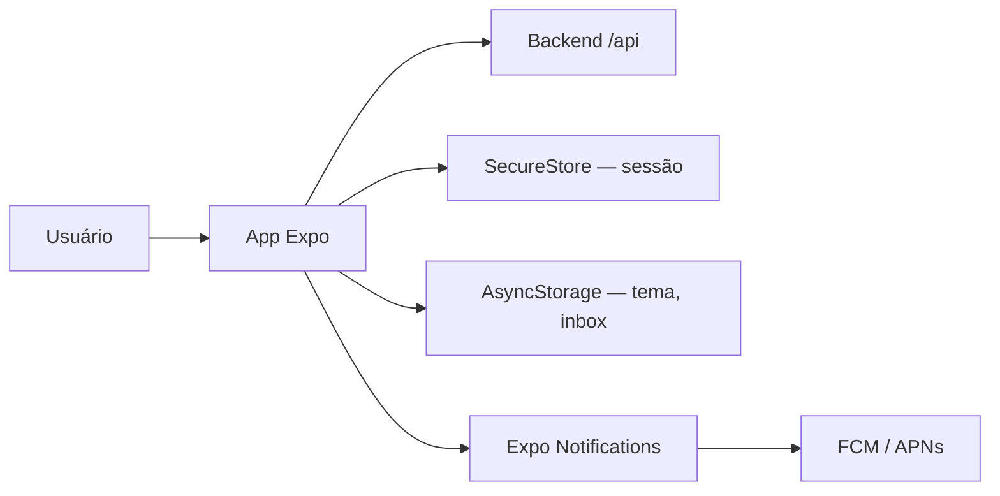

---

## Arquitetura

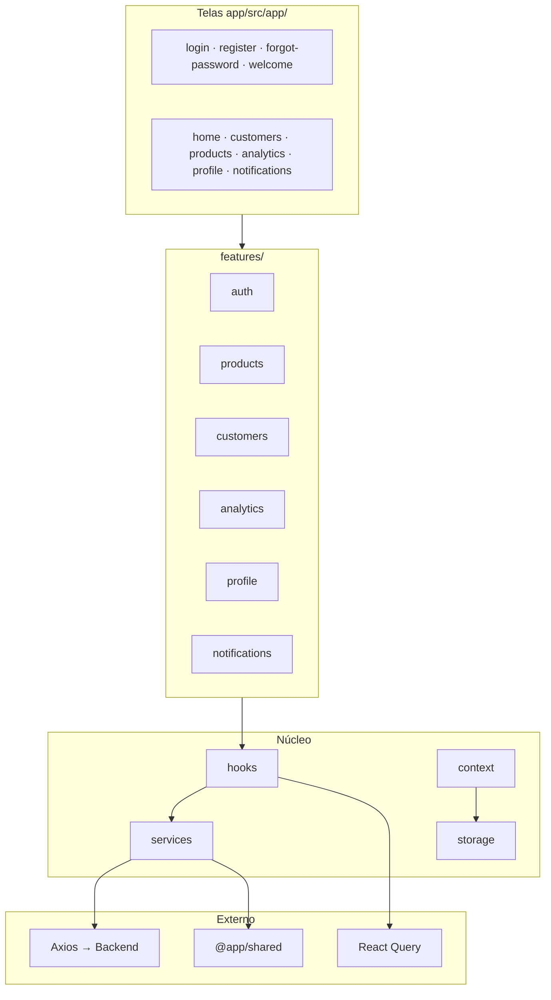

### Padrão por feature

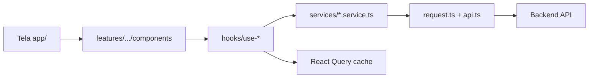

---

## Providers e bootstrap

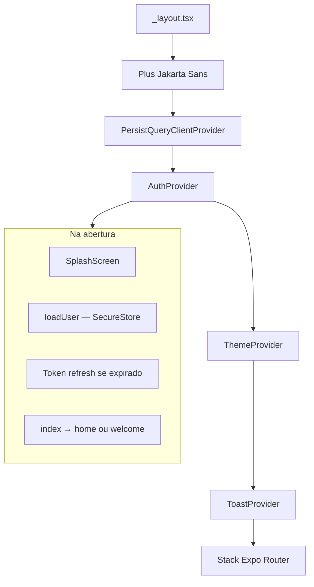

| Provider | Arquivo | Função |
|----------|---------|--------|
| `PersistQueryClientProvider` | `_layout.tsx` | Cache React Query em AsyncStorage (24h) |
| `AuthProvider` | `auth.context.tsx` | Sessão, login, logout, biometria |
| `ThemeProvider` | `theme.context.tsx` | Tema claro/escuro |
| `ToastProvider` | `toast.context.tsx` | Feedback visual |

**Queries não persistidas:** `products`, `customers`, `profile` — sempre rebuscam ao abrir.

---

## Navegação

Roteamento **file-based** em `app/src/app/`.

### Mapa de rotas

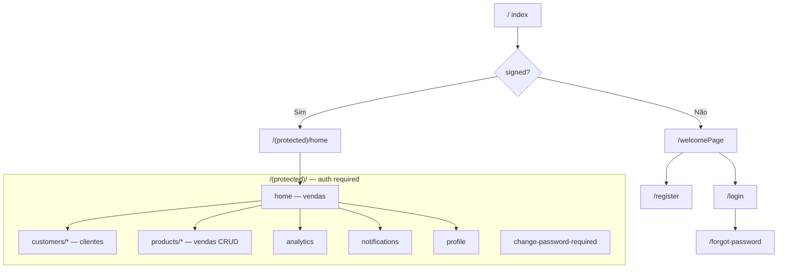

### Guards

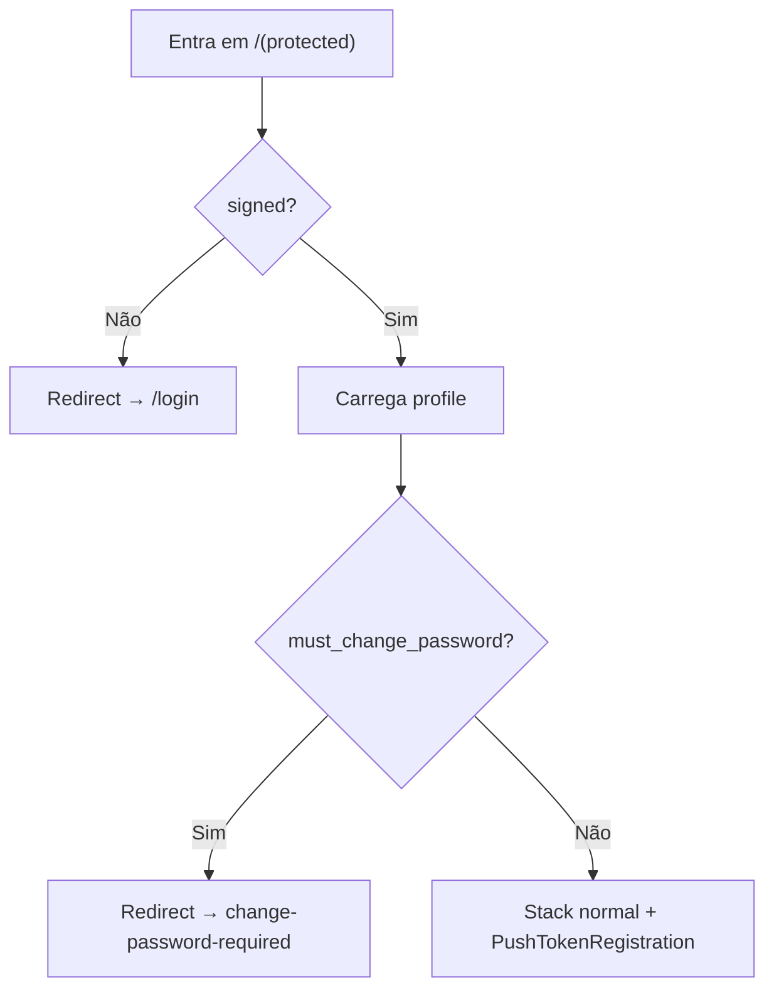

| Layout | Arquivo | Responsabilidade |
|--------|---------|------------------|
| Root | `_layout.tsx` | Providers globais |
| Protected | `(protected)/_layout.tsx` | Auth guard, senha obrigatória, push/inbox listeners |

### Transições

Definidas em `constants/navigation-transitions.ts`:

| Tipo | Uso |
|------|-----|
| `pushTransition` | Telas padrão |
| `modalTransition` | new/edit (clientes, produtos) |
| `fadeTransition` | analytics, notifications |

---

## Autenticação e sessão

### Fluxos de login

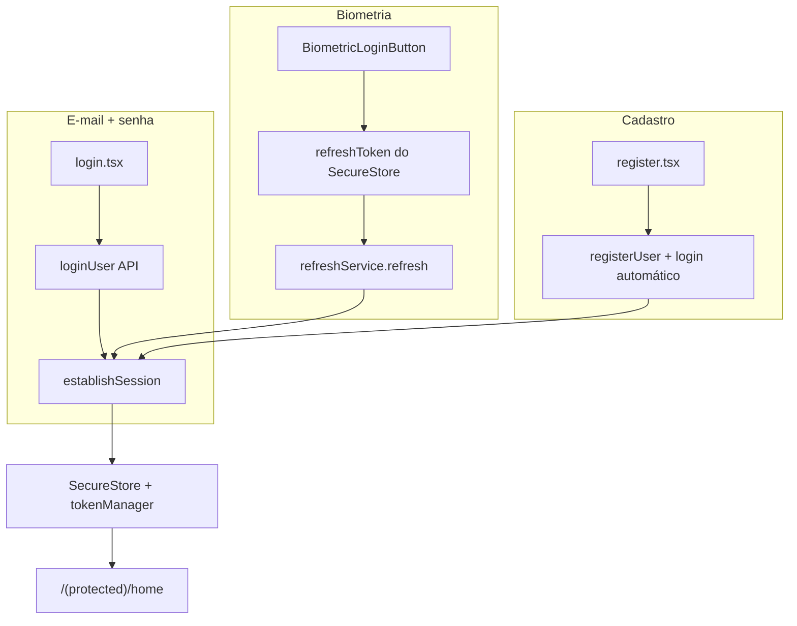

### Ciclo de vida da sessão

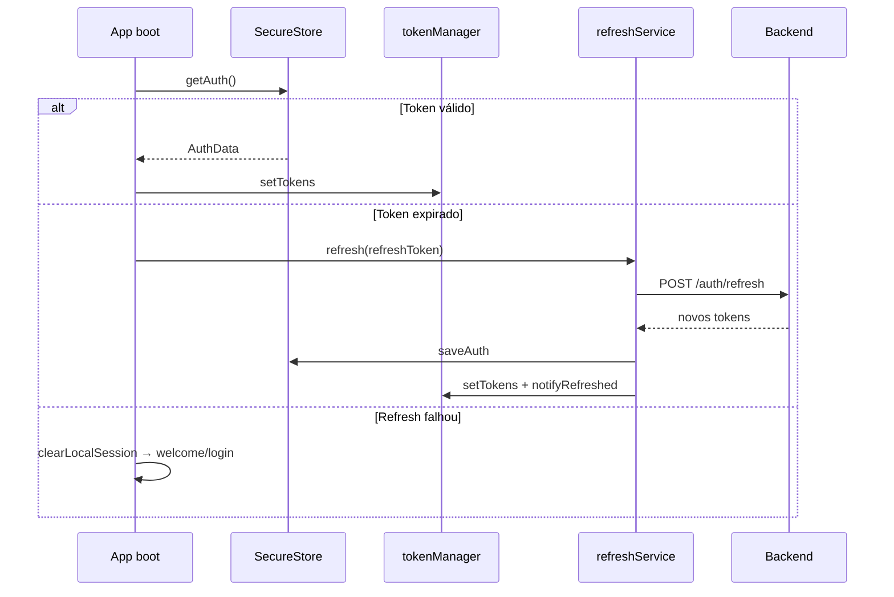

### Logout

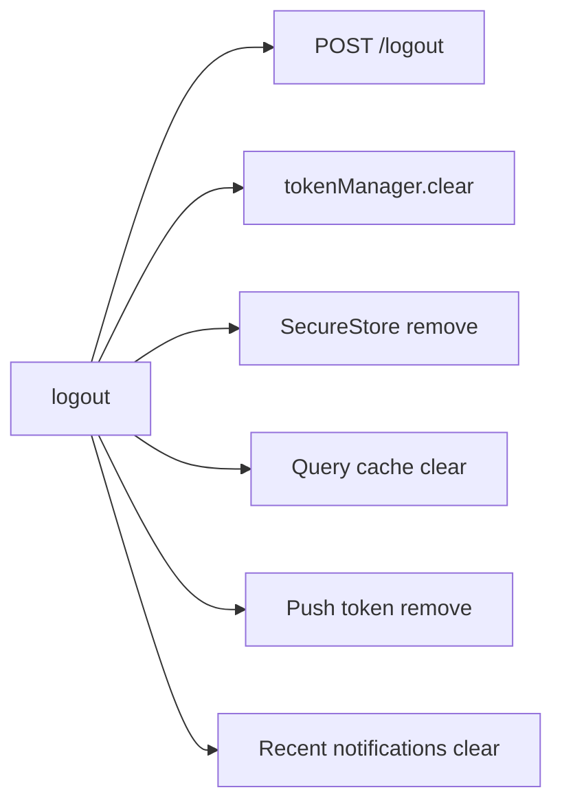

### Biometria

| Ação | Onde | O que guarda |
|------|------|--------------|
| Ativar | Perfil → card biométrico | `email` + `refreshToken` no SecureStore |
| Login | Botão na tela de login | Refresh via token biométrico |
| Desativar | Perfil | Remove credenciais biométricas |

Detalhes de senha: [Fluxo de troca de senha](./README.md)

---

## HTTP e refresh de token

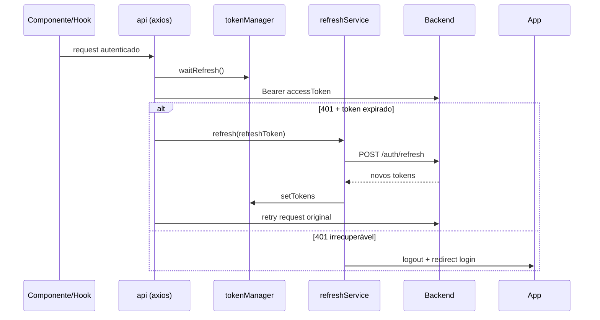

| Arquivo | Função |
|---------|--------|
| `services/api.ts` | Instância Axios + interceptors |
| `services/request.ts` | Wrapper `requestData` tipado |
| `services/token.manager.ts` | Tokens em memória + lock de refresh |
| `services/refresh.service.ts` | Refresh único (deduplicado) |

**Regra crítica:** requests aguardam `tokenManager.waitRefresh()` para não usar access token expirado durante o boot.

---

## Camada de dados

### React Query

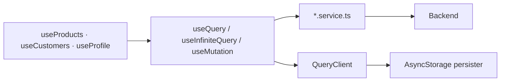

| Hook | Query key | Tipo |
|------|-----------|------|
| `useProducts` | `["products", filters]` | Infinite query (paginação) |
| `useCustomers` | `["customers", ...]` | Infinite query |
| `useProfile` | `["profile"]` | Query simples |
| `useProductAnalytics` | analytics key | Query |
| `useRecentNotifications` | `recent-notifications` | Query local |

### Serviços HTTP

| Serviço | Domínio |
|---------|---------|
| `auth.service.ts` | login, register, refresh, password reset |
| `profile.service.ts` | perfil, senha |
| `product.service.ts` | CRUD vendas, analytics |
| `customer.service.ts` | CRUD clientes |
| `notification.service.ts` | settings + push token API |
| `push-notifications.service.ts` | permissões, Expo token, enable/disable |
| `recent-notifications.service.ts` | inbox local |

Rotas centralizadas em `config/api-routes.ts`. URL base em `config/env.ts` ← `api-url.generated.ts`.

### Schemas compartilhados

Validação Zod alinhada ao backend via `@app/shared`:

- Produtos, clientes, notificações → shared
- Auth (login, register, senha) → `schemas/auth.schema.ts` local

---

## Features

### Mapa funcional

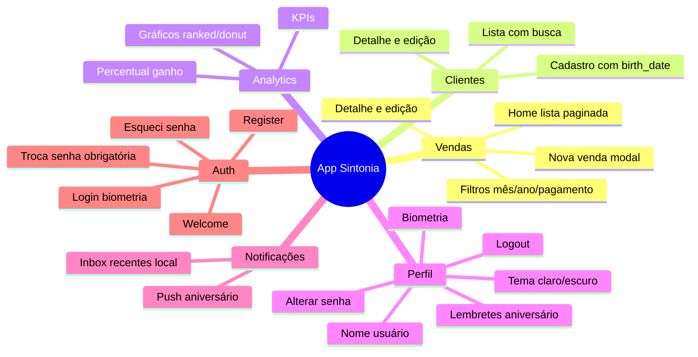

### Home (vendas)

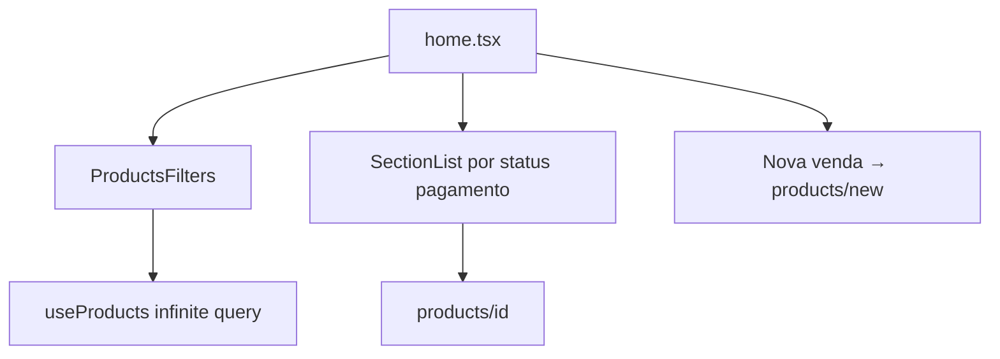

### Clientes

| Tela | Rota | Ação |
|------|------|------|
| Lista | `customers/index` | Busca, resumo, FAB novo |
| Novo | `customers/new` | Modal — `CustomerForm` |
| Detalhe | `customers/[id]` | Ver + ações |
| Editar | `customers/[id]/edit` | Modal — inclui `birth_date` |

`birth_date` alimenta o cron de aniversário no backend.

### Analytics

| Tela | Rota | Dados |
|------|------|-------|
| Dashboard | `analytics` | `GET /products/analytics` |
| % ganho | card no dashboard | `PATCH /profile/earnings-percent` + storage local |

### Perfil

| Card | Função |
|------|--------|
| `ProfileUserCard` | Nome de exibição |
| `ProfileThemeCard` | Tema claro/escuro |
| `ProfileBiometricCard` | Login biométrico |
| `ProfileBirthdayNotificationsCard` | Push aniversários |
| `ProfileChangePasswordCard` | Troca de senha |
| `ProfileLogoutButton` | Sair |

### Notificações

Dois subsistemas — detalhes em [FLUXO_NOTIFICACOES.md](./FLUXO_NOTIFICACOES.md):

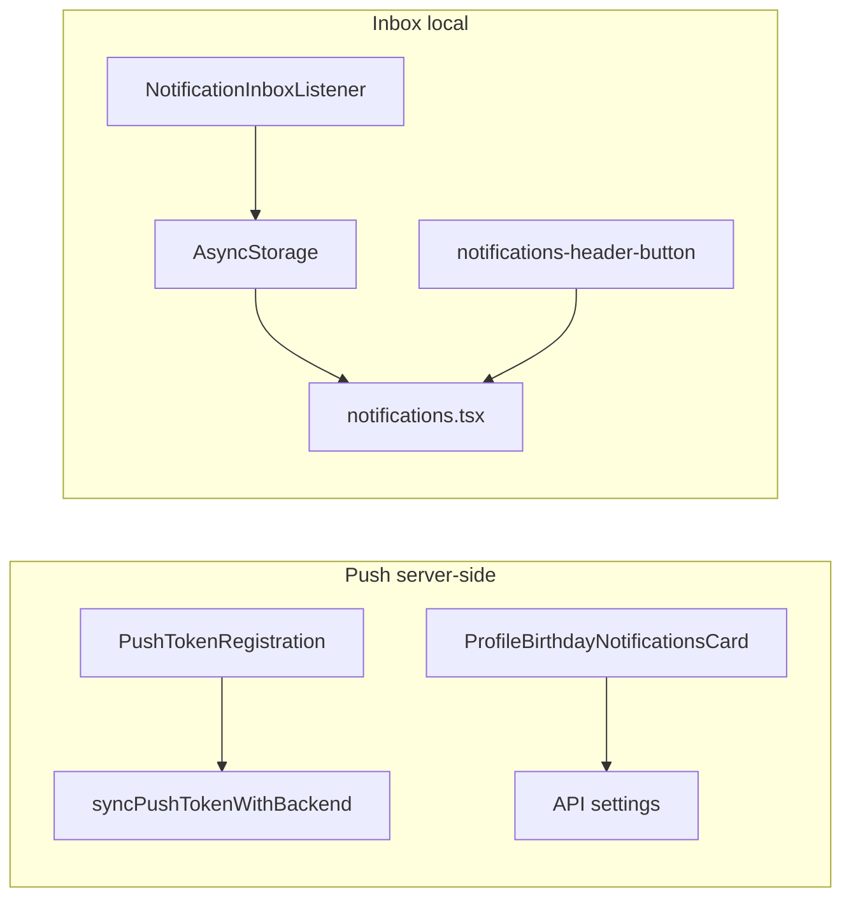

---

## Armazenamento local

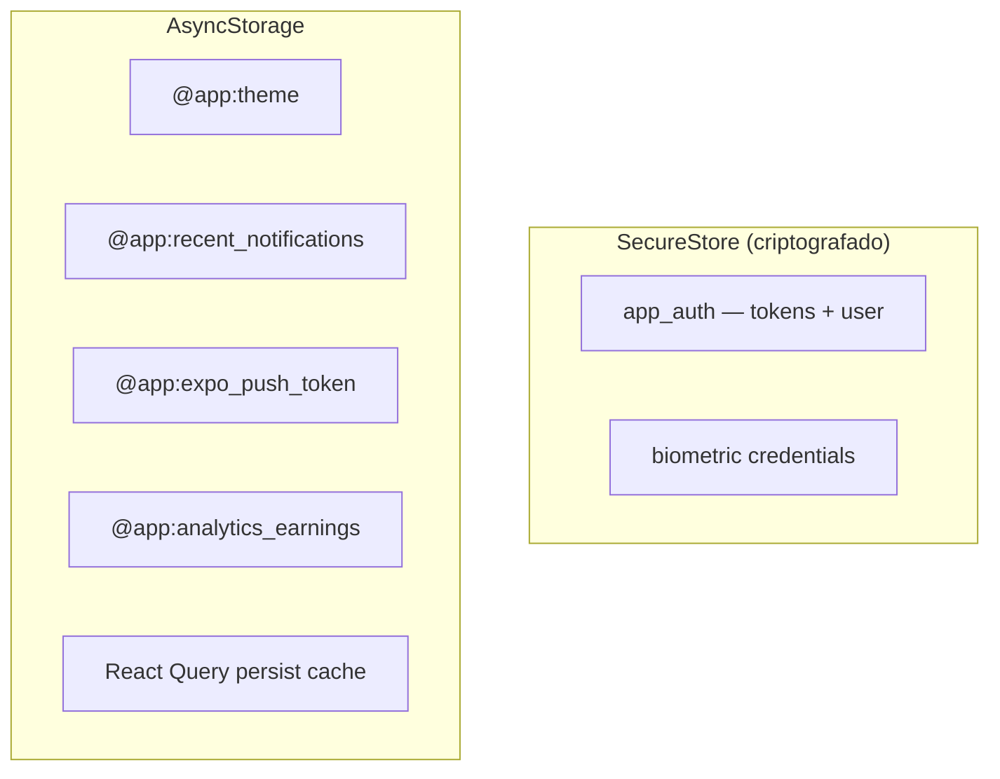

| Chave | Conteúdo | Quando limpa |
|-------|----------|--------------|
| `app_auth` | Sessão completa | Logout |
| Biometric | email + refreshToken | Desativar biometria / falha |
| `@app:recent_notifications` | Até 50 notificações | Logout / limpar manual |
| `@app:expo_push_token` | Token Expo local | Logout |

---

## Tema e UI

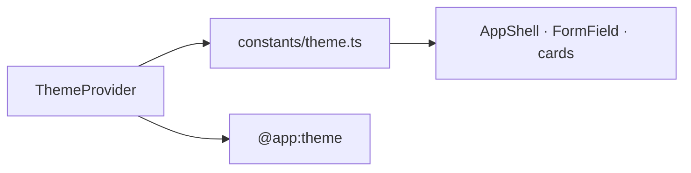

| Peça | Descrição |
|------|-----------|
| **AppShell** | Layout padrão — header gradiente, back, settings |
| **FormField** | Input com ícone, erro, toggle senha |
| **Motion** | Animações Reanimated (`components/ui/motion.ts`) |
| **Fonte** | Plus Jakarta Sans (400–800) |
| **Ícones** | Lucide React Native |
| **Gráficos** | react-native-gifted-charts (analytics) |

Tema padrão: **dark**. Usuário alterna no perfil.

---

## Configuração e build

### URL da API

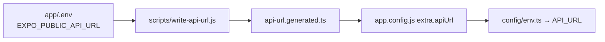

| Valor `EXPO_PUBLIC_API_URL` | Comportamento |
|-----------------------------|---------------|
| `auto` | IP da máquina na rede local |
| `emulator` | `10.0.2.2` (Android emulator) |
| URL fixa | ex. `http://192.168.x.x:3001/api` |

Template: `app/env-exemple`. Em produção exige **HTTPS**.

### Comandos

```bash
# Desenvolvimento
cd app
cp env-exemple .env    # ajuste EXPO_PUBLIC_API_URL
npm start              # gera api-url + expo start

# Android nativo
npm run android

# APK release (monorepo)
./build-apk.sh --clean-prebuild
```

### Config nativa relevante

| Arquivo | Função |
|---------|--------|
| `app.json` | Expo config, permissões, plugins |
| `app.config.js` | API URL, google-services, cleartext dev |
| `google-services.json` | Firebase Android (push) |
| `eas.json` | Perfis EAS Build |
| `version.build.json` | `versionCode` Android |

Expo Project ID: `bf241346-b604-4df1-972f-8c8fae3c9628`

---

## Estrutura de pastas

```
app/
├── src/
│   ├── app/                        # Rotas Expo Router
│   │   ├── _layout.tsx             # Providers globais
│   │   ├── index.tsx               # Redirect inicial
│   │   ├── welcomePage.tsx
│   │   ├── login.tsx · register.tsx · forgot-password.tsx
│   │   └── (protected)/
│   │       ├── _layout.tsx         # Auth guard + push listeners
│   │       ├── home.tsx
│   │       ├── customers/ · products/
│   │       ├── analytics.tsx · profile.tsx · notifications.tsx
│   │       └── change-password-required.tsx
│   ├── features/                   # UI por domínio
│   │   ├── auth/ · products/ · customers/
│   │   ├── analytics/ · profile/ · notifications/ · welcome/
│   ├── components/                 # UI compartilhada
│   │   ├── appShell.tsx · layout/ · ui/
│   ├── context/                    # Auth, Theme, Toast
│   ├── hooks/                      # React Query wrappers
│   ├── services/                   # HTTP + push + request
│   ├── storage/                    # SecureStore + AsyncStorage
│   ├── schemas/                    # Zod local (auth)
│   ├── config/                     # api-routes, env
│   ├── constants/                  # theme, motion, transitions
│   └── lib/                        # query-client, persister
├── scripts/                        # write-api-url, load-app-env, bump version
├── app.json · app.config.js
├── env-exemple
└── package.json
```

---

## Ciclo de vida — resumo

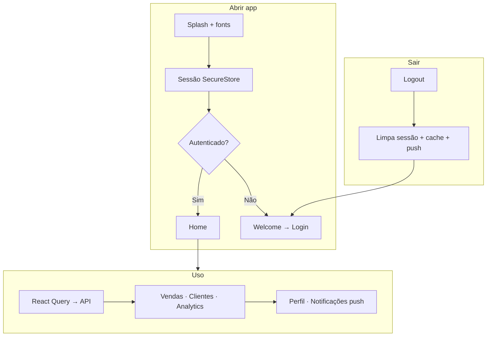

---

## Documentação relacionada

- [Backend — API Express](./BACKEND.md)
- [Fluxo de troca de senha](./README.md)
- [Fluxo de notificações](./FLUXO_NOTIFICACOES.md)
- Template env: `app/env-exemple`
- Build APK: `./build-apk.sh` na raiz do monorepo
