# Backend — API loja-joias

Documentação completa da API **Express + TypeScript** do monorepo **loja-joias**: arquitetura, fluxos, módulos, autenticação, deploy e referência de endpoints.

---

## Índice

1. [Visão geral](#visão-geral)
2. [Arquitetura](#arquitetura)
3. [Inicialização e encerramento](#inicialização-e encerramento)
4. [Pipeline de uma requisição](#pipeline-de-uma-requisição)
5. [Autenticação e sessão](#autenticação-e-sessão)
6. [Clientes Supabase](#clientes-supabase)
7. [Camadas da aplicação](#camadas-da-aplicação)
8. [Módulos da API](#módulos-da-api)
9. [Notificações (cron)](#notificações-cron)
10. [Rate limiting e Redis](#rate-limiting-e-redis)
11. [Tratamento de erros](#tratamento-de-erros)
12. [Variáveis de ambiente](#variáveis-de-ambiente)
13. [Desenvolvimento local](#desenvolvimento-local)
14. [Deploy (Render)](#deploy-render)
15. [Estrutura de pastas](#estrutura-de-pastas)
16. [Documentação relacionada](#documentação-relacionada)

---

## Visão geral

| Item | Detalhe |
|------|---------|
| **Runtime** | Node.js ≥ 20 |
| **Framework** | Express 5 |
| **Banco / Auth** | Supabase (PostgreSQL + Auth) |
| **Validação** | Zod |
| **Pacote compartilhado** | `@app/shared` (schemas DTO) |
| **Prefixo da API** | `/api` |
| **Porta padrão** | `3001` |
| **Deploy** | Render (`financeiro-api`) |

O backend é a **única camada** que o app mobile consome. Ele orquestra Supabase Auth, aplica regras de negócio, rate limit, revogação de tokens e o cron de notificações push.

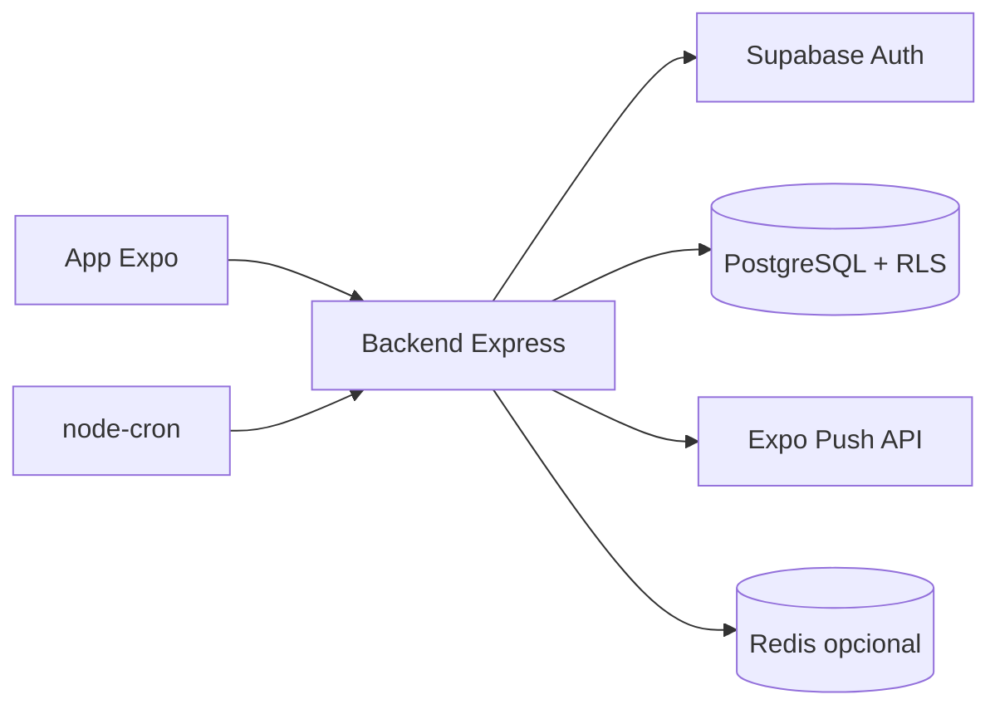

---

## Arquitetura

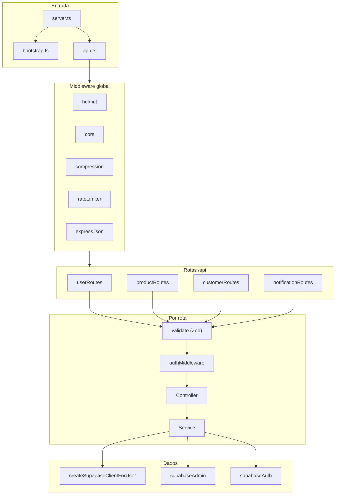

---

## Inicialização e encerramento

### Startup

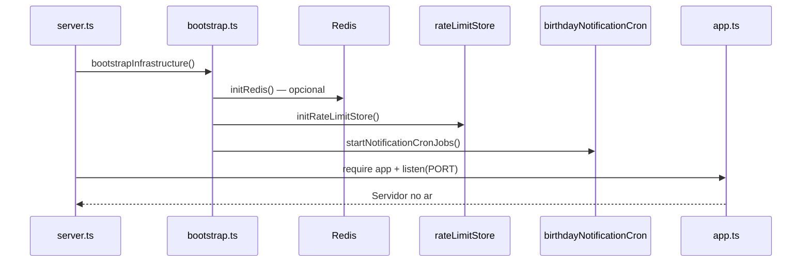

### Shutdown graceful

```mermaid
flowchart LR
    Signal[SIGTERM / SIGINT] --> Close[server.close()]
    Close --> StopCron[stopNotificationCronJobs]
    StopCron --> CloseRedis[closeRedis]
    CloseRedis --> Exit[process.exit 0]
```

| Arquivo | Função |
|---------|--------|
| `src/server.ts` | Bootstrap, listen, sinais de encerramento |
| `src/bootstrap.ts` | Redis, rate limit store, cron |
| `src/app.ts` | Express app + middleware + rotas |

---

## Pipeline de uma requisição

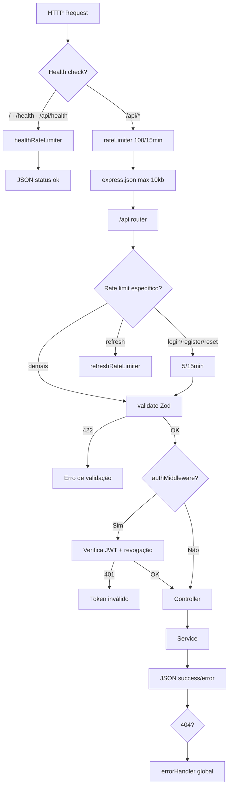

### Health check

| Rota | Uso |
|------|-----|
| `GET /` | Render / monitoramento |
| `GET /health` | Alias |
| `GET /api/health` | `healthCheckPath` no Render |

Em produção retorna `{ "status": "ok" }`. Em dev inclui `env`.

---

## Autenticação e sessão

Autenticação via **JWT do Supabase**. O app envia `Authorization: Bearer <access_token>`.

### Login

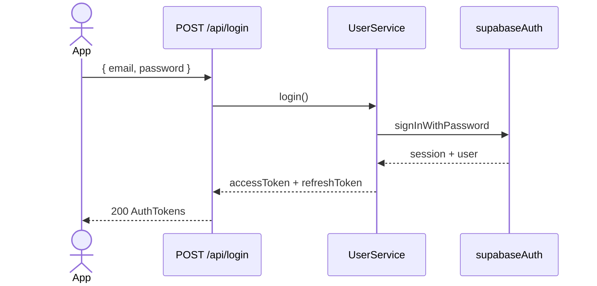

### Refresh

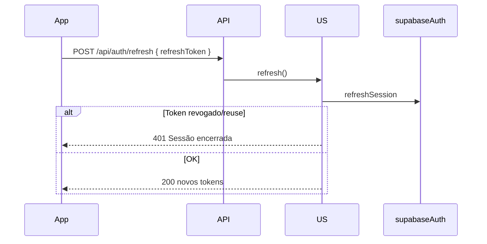

### Logout

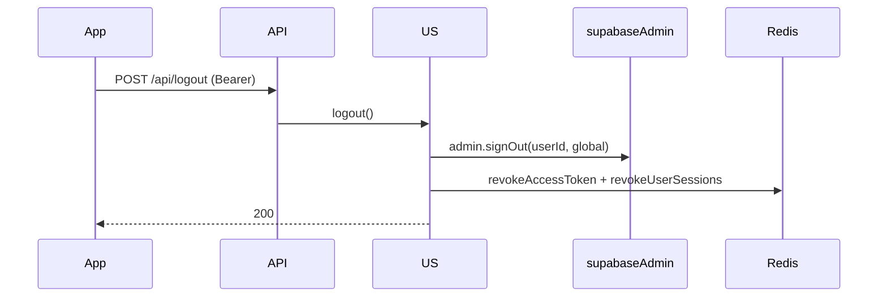

### Verificação em rotas protegidas

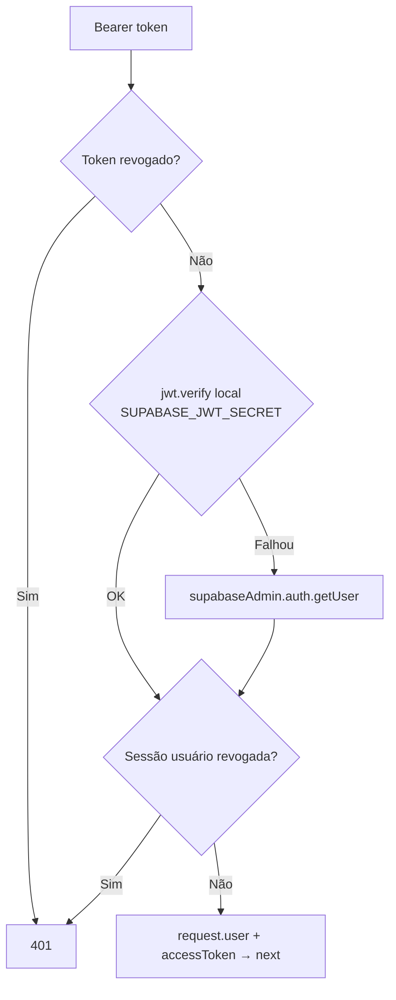

| Mecanismo | Onde |
|-----------|------|
| Verificação JWT local | Rápida, sem round-trip ao Supabase |
| Fallback `getUser` | Tokens edge-case |
| Revogação por token | Logout — hash SHA-256 no Redis/memória |
| Revogação por usuário | Logout global — bloqueia tokens antigos ~1h |

---

## Clientes Supabase

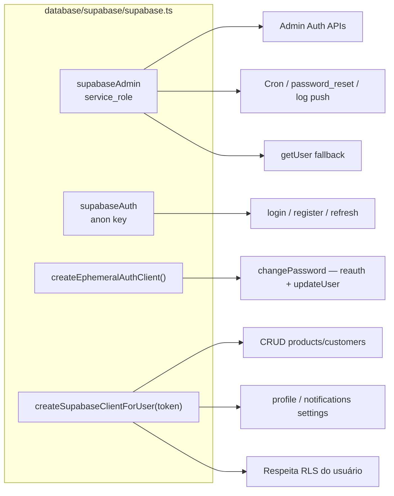

| Cliente | Chave | Quando usar |
|---------|-------|-------------|
| `supabaseAdmin` | `service_role` | Operações admin, cron, bypass RLS |
| `supabaseAuth` | `anon` | Fluxos de auth (cliente compartilhado) |
| `createEphemeralAuthClient()` | `anon` | Reauth isolada (troca de senha) |
| `createSupabaseClientForUser(token)` | `anon` + Bearer | Queries com RLS do usuário logado |

> **Nunca** exponha `SUPABASE_SERVICE_ROLE_KEY` no app.

---

## Camadas da aplicação

Padrão consistente em todos os módulos:

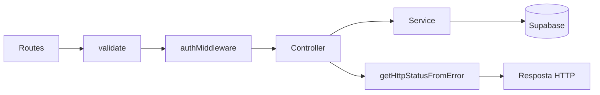

### ServiceResult

Services retornam discriminated union — **nunca** lançam exceção para erro de negócio:

```typescript
type ServiceResult<T, E> =
  | { status: true; data: T }
  | { status: false; error: { code: E; message?: string } }
```

Controllers mapeiam `error.code` → HTTP status via `*ErrorHttpMapper`.

### Formato de resposta

**Sucesso:**
```json
{
  "success": true,
  "message": "Opcional",
  "data": { }
}
```

**Erro:**
```json
{
  "success": false,
  "message": "Descrição legível"
}
```

**Validação (422):**
```json
{
  "success": false,
  "message": "Erro de validação",
  "errors": [{ "field": "email", "message": "..." }]
}
```

---

## Módulos da API

### Mapa de rotas

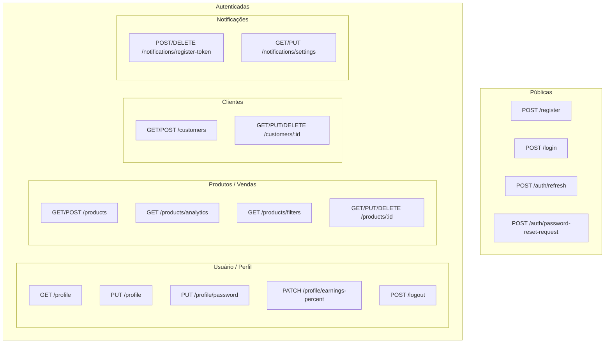

### Usuários e perfil

| Método | Rota | Service | Descrição |
|--------|------|---------|-----------|
| `POST` | `/api/register` | `UserService.register` | Cadastro via Supabase Auth |
| `POST` | `/api/login` | `UserService.login` | Retorna access + refresh token |
| `POST` | `/api/logout` | `UserService.logout` | Sign out global + revoga tokens |
| `POST` | `/api/auth/refresh` | `UserService.refresh` | Renova sessão |
| `POST` | `/api/auth/password-reset-request` | `UserService.requestPasswordReset` | Solicitação manual de reset |
| `GET` | `/api/profile` | `UserService.getProfile` | Perfil + `must_change_password` |
| `PUT` | `/api/profile` | `UserService.updateProfile` | Atualiza username |
| `PUT` | `/api/profile/password` | `UserService.changePassword` | Troca de senha |
| `PATCH` | `/api/profile/earnings-percent` | `UserService.updateEarningsPercent` | % ganho (analytics) |

Detalhes: [Fluxo de troca de senha](./README.md)

### Produtos (vendas)

| Método | Rota | Descrição |
|--------|------|-----------|
| `POST` | `/api/products` | Criar venda |
| `GET` | `/api/products` | Listar com filtros/paginação |
| `GET` | `/api/products/analytics` | KPIs e gráficos |
| `GET` | `/api/products/filters` | Metadados (anos, tipos) |
| `GET` | `/api/products/:id` | Detalhe |
| `PUT` | `/api/products/:id` | Atualizar |
| `DELETE` | `/api/products/:id` | Excluir |

Schemas: `@app/shared` — `createProductSchema`, `listProductsQuerySchema`, etc.

### Clientes

| Método | Rota | Descrição |
|--------|------|-----------|
| `POST` | `/api/customers` | Criar cliente |
| `GET` | `/api/customers` | Listar com busca/paginação |
| `GET` | `/api/customers/:id` | Detalhe |
| `PUT` | `/api/customers/:id` | Atualizar |
| `DELETE` | `/api/customers/:id` | Excluir |

Regras: telefone único por usuário, `birth_date` usado pelo cron de aniversário.

### Notificações

| Método | Rota | Descrição |
|--------|------|-----------|
| `POST` | `/api/notifications/register-token` | Registra Expo push token |
| `DELETE` | `/api/notifications/register-token` | Remove token (logout) |
| `GET` | `/api/notifications/settings` | Preferências de lembrete |
| `PUT` | `/api/notifications/settings` | Salva horário + enabled |

Detalhes: [Fluxo de notificações](./FLUXO_NOTIFICACOES.md)

---

## Notificações (cron)

Iniciado em `bootstrap.ts`. Roda **no mesmo processo** do servidor Express.

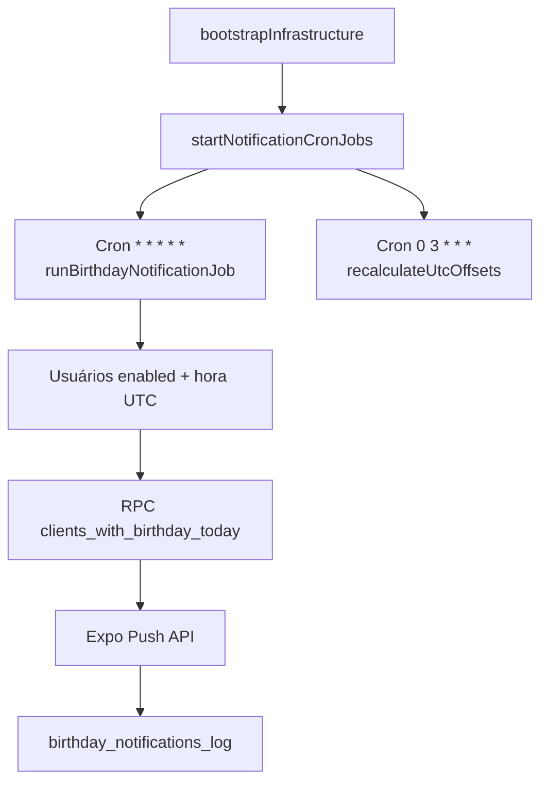

| Job | Schedule | Função |
|-----|----------|--------|
| Envio aniversários | A cada minuto | Busca aniversariantes e envia push |
| Manutenção UTC | 03:00 UTC diário | Recalcula offsets de timezone |

---

## Rate limiting e Redis

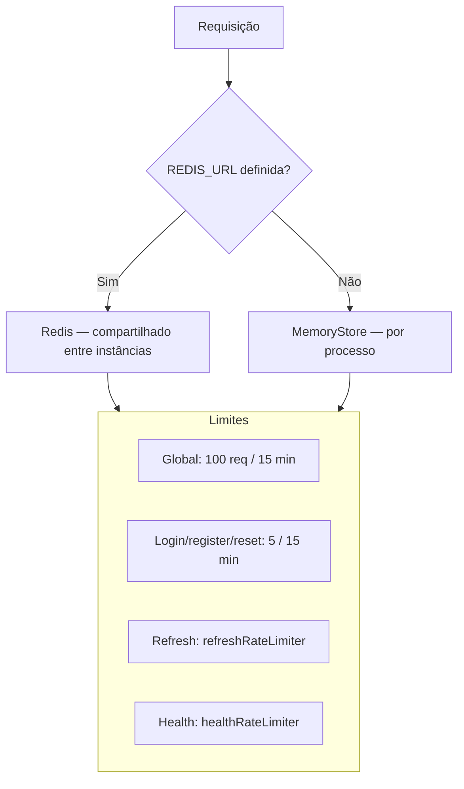

| Recurso | Com Redis | Sem Redis |
|---------|-----------|-----------|
| Rate limit | Contadores compartilhados | Reset a cada deploy |
| Revogação de tokens | Persistente entre instâncias | Map em memória |
| Obrigatório? | **Não** — fallback automático | Funciona em dev/single instance |

---

## Tratamento de erros

```mermaid
flowchart TD
    Service[Service retorna status false] --> Mapper[errorHttpMapper por domínio]
    Mapper --> Status[HTTP 4xx/5xx]
    Status --> JSON[{ success: false, message }]

    ValidateFail[validate Zod] --> 422[422 + errors array]
    AuthFail[authMiddleware] --> 401[401]
    NotFoundMW[notFound middleware] --> 404[404]
    Uncaught[Exceção não tratada] --> ErrorHandler[errorHandler]
```

| Domínio | Mapper |
|---------|--------|
| Usuário | `errors/userErrorHttpMapper.ts` |
| Produto | `errors/productErrorHttpMapper.ts` |
| Cliente | `errors/customerErrorHttpMapper.ts` |
| Notificação | `errors/notificationErrorHttpMapper.ts` |

### Swagger (dev)

Com `NODE_ENV=development`, documentação interativa em **`/api/docs`**.

---

## Variáveis de ambiente

Validadas em `src/config/env.ts` com Zod. Template: `backend/.env.example`.

| Variável | Obrigatória | Descrição |
|----------|:-----------:|-----------|
| `NODE_ENV` | Não | `development` · `production` · `test` |
| `PORT` | Não | Porta HTTP (default `3001`) |
| `SUPABASE_URL` | Sim | URL do projeto Supabase |
| `SUPABASE_ANON_KEY` | Sim* | Chave anon (*ou `EXPO_PUBLIC_SUPABASE_ANON_KEY`) |
| `SUPABASE_SERVICE_ROLE_KEY` | Sim | Admin — **segredo** |
| `SUPABASE_JWT_SECRET` | Sim | JWT Secret (Settings → API) |
| `ALLOWED_ORIGINS` | Não | CORS, separado por vírgula |
| `TRUST_PROXY_HOPS` | Não | Default `1` (Render) |
| `RENDER_EXTERNAL_URL` | Não | Adicionado automaticamente ao CORS |
| `REDIS_URL` | Não | Rate limit + revogação distribuída |

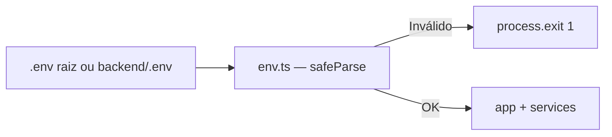

---

## Desenvolvimento local

```bash
# Na raiz do monorepo
npm install

# Configure .env (copie backend/.env.example)
cp backend/.env.example .env
# Preencha SUPABASE_* 

# Build do pacote shared (dependência do backend)
npm run build -w packages/shared

# Dev com hot reload
npm run dev -w backend
# ou: cd backend && npm run dev
```

| Comando | Descrição |
|---------|-----------|
| `npm run dev -w backend` | `ts-node-dev` — porta 3001 |
| `npm run build -w backend` | Compila para `backend/dist/` |
| `npm run start -w backend` | `node dist/server.js` |

### Script de suporte

```bash
cd backend
npx ts-node scripts/reset-user-password.ts usuario@email.com
```

Requer `SUPABASE_URL` + `SUPABASE_SERVICE_ROLE_KEY` no `.env`.

---

## Deploy (Render)

Definido em `render.yaml`:

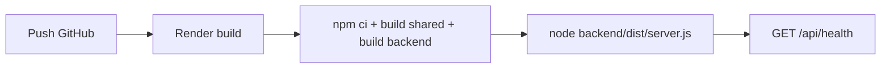

| Config | Valor |
|--------|-------|
| Serviço | `financeiro-api` |
| Região | Oregon |
| Build | `npm ci --include=dev && npm run build -w packages/shared && npm run build -w backend` |
| Start | `node backend/dist/server.js` |
| Health | `/api/health` |

Secrets configurados no painel Render (`sync: false` no yaml).

---

## Estrutura de pastas

```
backend/
├── scripts/
│   └── reset-user-password.ts      # Suporte — reset manual de senha
├── src/
│   ├── app.ts                      # Express app + middleware
│   ├── server.ts                   # Entry point
│   ├── bootstrap.ts                # Redis, cron, rate limit store
│   ├── config/
│   │   ├── env.ts                  # Validação de env
│   │   └── swagger.ts              # OpenAPI spec
│   ├── controllers/                # HTTP → Service → JSON
│   ├── services/                   # Regras de negócio
│   ├── routes/                     # Rotas Express
│   ├── middleware/
│   │   ├── auth.ts                 # JWT + revogação
│   │   ├── validate.ts             # Zod
│   │   ├── rateLimiter.ts          # Limites globais/específicos
│   │   ├── errorHandler.ts
│   │   └── notFound.ts
│   ├── jobs/
│   │   └── birthdayNotificationCron.ts
│   ├── database/
│   │   ├── supabase/supabase.ts    # Clientes Supabase
│   │   └── redis/redis.ts          # Redis opcional
│   ├── schemas/                    # Zod (auth, senha, push...)
│   ├── errors/                     # code → HTTP status
│   ├── types/                      # ServiceResult, codes, DTOs
│   ├── utils/                      # Helpers (token, queries, cache)
│   ├── constants/                  # SELECT fields
│   └── docs/                       # Swagger JSDoc
├── .env.example
├── package.json
├── tsconfig.json
└── dockerfile
```

### Dependência `@app/shared`

Schemas de produtos, clientes e notificações vivem em `packages/shared` e são importados nas routes (`validate`) e, quando necessário, nos services.

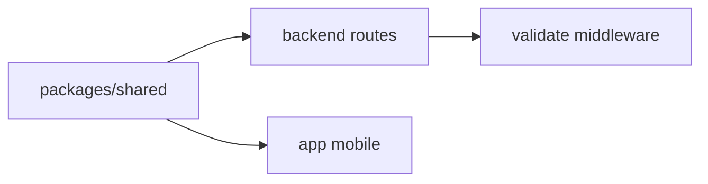

---

## Ciclo de vida — resumo

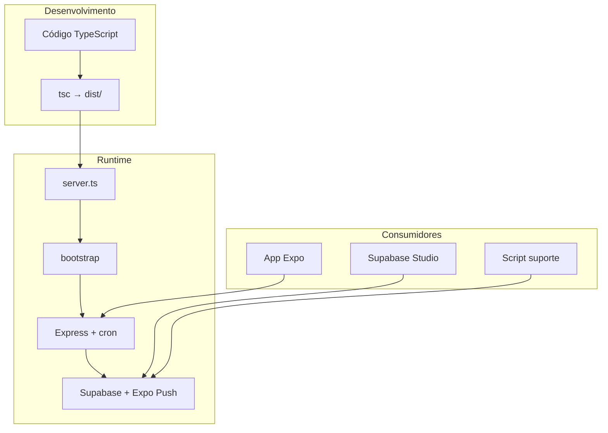

---

## Documentação relacionada

- [Fluxo de troca de senha (app)](./README.md)
- [Fluxo de notificações (app + cron)](./FLUXO_NOTIFICACOES.md)
- [App — Expo / React Native](./APP.md)
- Migrations SQL: `supabase/migrations/`
- Template de env: `backend/.env.example`
