# Fluxo de notificações

Documentação completa do sistema de **lembretes de aniversário de clientes** no app **loja-joias**. As notificações são enviadas pelo **servidor** via **Expo Push API** — o app não agenda notificações localmente.

---

## Índice

1. [Visão geral](#visão-geral)
2. [Arquitetura](#arquitetura)
3. [Fluxo 1 — Ativar lembretes no perfil](#fluxo-1--ativar-lembretes-no-perfil)
4. [Fluxo 2 — Envio automático (cron)](#fluxo-2--envio-automático-cron)
5. [Fluxo 3 — Recebimento no dispositivo](#fluxo-3--recebimento-no-dispositivo)
6. [Fluxo 4 — Caixa de notificações recentes](#fluxo-4--caixa-de-notificações-recentes)
7. [Fluxo 5 — Logout e desativação](#fluxo-5--logout-e-desativação)
8. [Fuso horário e UTC](#fuso-horário-e-utc)
9. [Banco de dados](#banco-de-dados)
10. [Endpoints da API](#endpoints-da-api)
11. [Configuração Firebase / Expo (Android)](#configuração-firebase--expo-android)
12. [Segurança e performance](#segurança-e-performance)
13. [Referência de arquivos](#referência-de-arquivos)

---

## Visão geral

O sistema avisa o lojista quando um **cliente faz aniversário no dia**, no horário configurado no perfil.

| Camada | Responsabilidade |
|--------|------------------|
| **App** | Permissão push, registro de token, preferências (ligar/desligar + horário) |
| **Backend** | Cron minuto a minuto, busca aniversariantes, envia push via Expo |
| **Supabase** | Tokens, configurações, log anti-duplicata |
| **Expo + FCM/APNs** | Entrega da notificação no dispositivo |

### Dois subsistemas no app

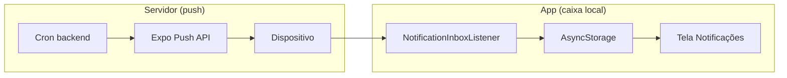

| Subsistema | Onde vive | Função |
|------------|-----------|--------|
| **Push de aniversário** | Backend + Expo | Enviar lembrete no horário configurado |
| **Inbox recente** | Só no celular | Listar notificações recebidas (até 50), abrir cliente |

> A lista de notificações recentes **não vem do servidor** — é armazenada localmente no dispositivo.

### Mapa geral

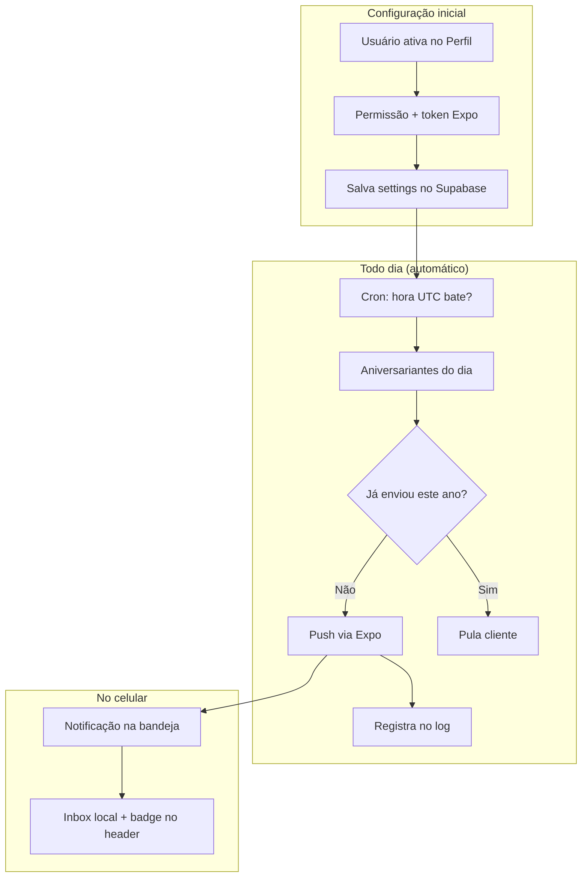

---

## Arquitetura

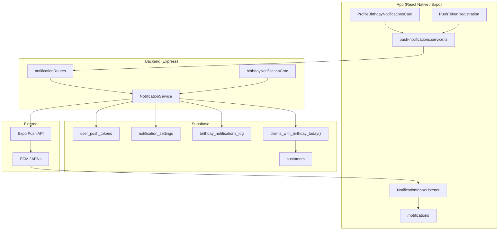

---

## Fluxo 1 — Ativar lembretes no perfil

### Jornada no app

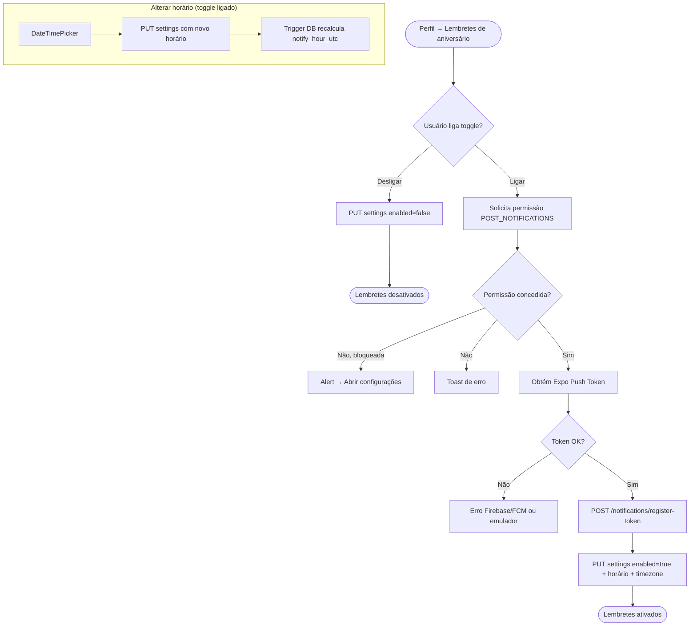

### Sequência técnica (ativar)

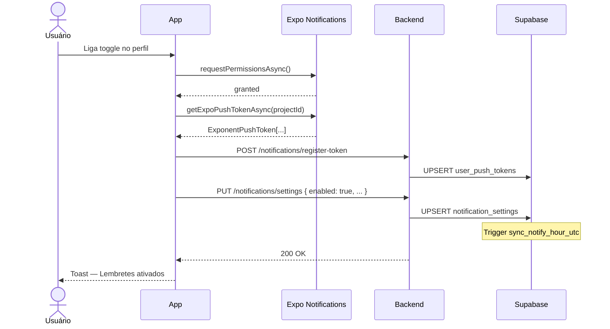

### Valores padrão

| Campo | Padrão |
|-------|--------|
| Horário | 09:00 |
| Timezone | Fuso do dispositivo (`Intl`) ou `America/Sao_Paulo` |
| `enabled` | `false` até o usuário ativar |

### Requisitos do dispositivo

| Condição | Resultado |
|----------|-----------|
| Celular físico | Obrigatório — emulador não obtém token push |
| Android | `google-services.json` + FCM V1 no Expo |
| Permissão negada | Toggle não ativa; opção de abrir configurações do SO |

---

## Fluxo 2 — Envio automático (cron)

O backend roda um **cron a cada minuto** e processa usuários cujo horário UTC coincide com o instante atual.

### Cron jobs

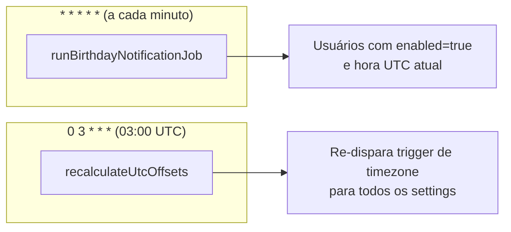

### Lógica de envio por usuário

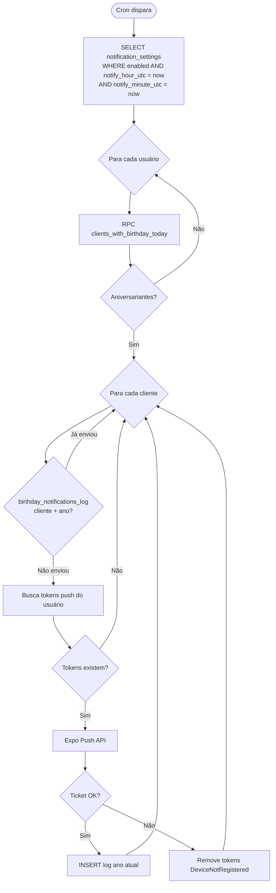

### Sequência técnica (envio)

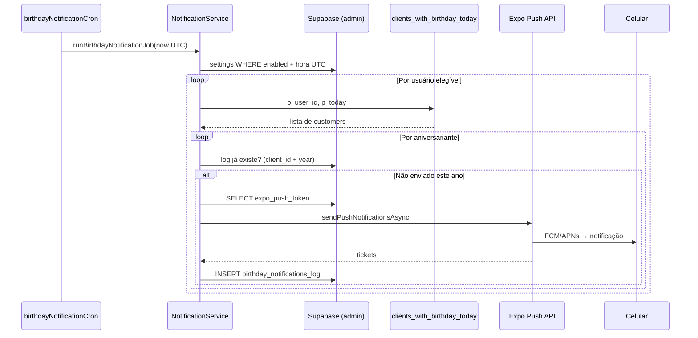

### Conteúdo da notificação push

| Campo | Valor |
|-------|-------|
| **title** | `Aniversário hoje` |
| **body** | `{nome do cliente} faz aniversário hoje. Aproveite para parabenizar!` |
| **data.type** | `customer-birthday` |
| **data.customerId** | UUID do cliente |
| **sound** | `default` |

### Anti-duplicata

Cada par `(client_id, year_sent)` é único na tabela `birthday_notifications_log`. Um cliente recebe **no máximo 1 push por ano**, mesmo que o cron rode várias vezes no mesmo minuto.

---

## Fluxo 3 — Recebimento no dispositivo

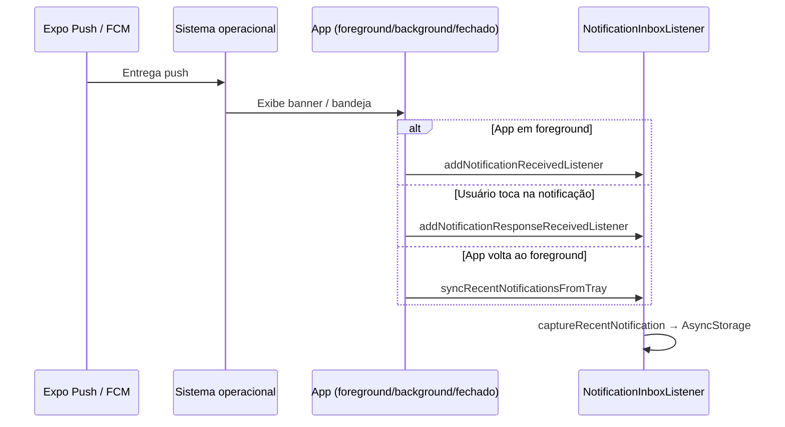

### Comportamento por estado do app

| Estado do app | O que acontece |
|---------------|----------------|
| **Fechado** | SO exibe notificação; ao abrir, sincroniza bandeja |
| **Background** | Banner + entrada na inbox ao voltar |
| **Foreground** | Listener captura e atualiza lista imediatamente |

---

## Fluxo 4 — Caixa de notificações recentes

Tela acessível pelo ícone de sino no header. Dados **locais** (AsyncStorage, máx. 50 itens).

### Jornada

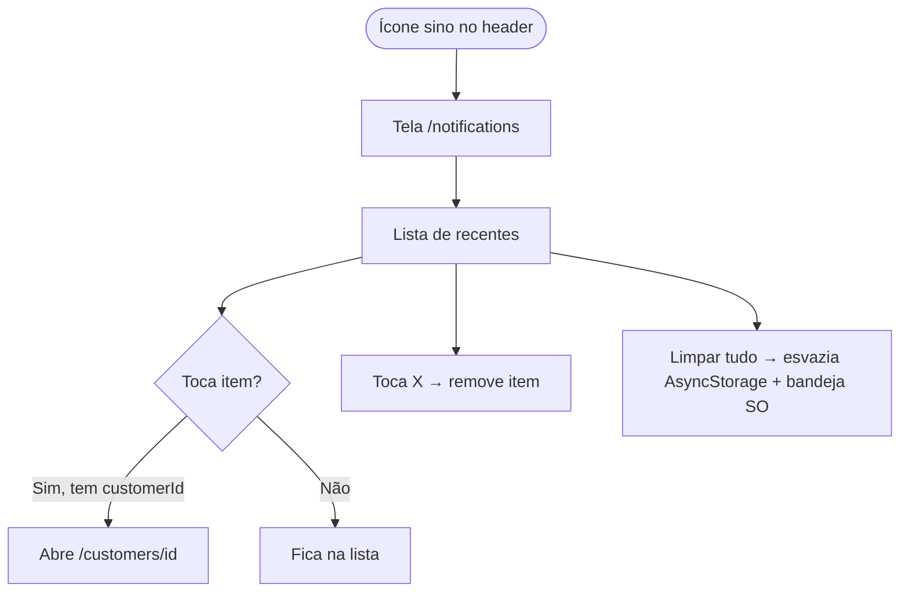

### Armazenamento local

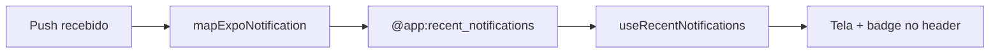

| Campo local | Origem |
|-------------|--------|
| `id` | identifier da notificação Expo |
| `title`, `body` | conteúdo do push |
| `receivedAt` | timestamp de recebimento |
| `customerId` | `data.customerId` do push |
| `type` | `data.type` (`customer-birthday`) |

---

## Fluxo 5 — Logout e desativação

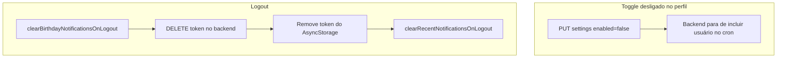

> Desativar o toggle **não** remove o token push do banco — apenas impede o envio. No logout, o token é removido do backend.

---

## Fuso horário e UTC

O usuário configura horário **local** (`notify_hour`, `notify_minute`, `timezone`). O cron compara em **UTC**.

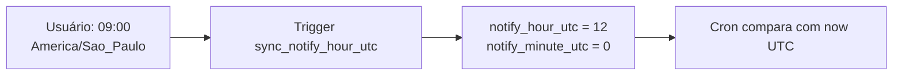

| Evento | Quando |
|--------|--------|
| INSERT/UPDATE em `notification_settings` | Trigger recalcula `notify_hour_utc` / `notify_minute_utc` |
| Cron de manutenção (03:00 UTC) | Re-processa todos os settings (útil após mudança de horário de verão) |

---

## Banco de dados

Migration: `supabase/migrations/20260802150000_birthday_push_notifications.sql`

### Modelo de dados

```mermaid
erDiagram
    users ||--o{ user_push_tokens : "user_id"
    users ||--o| notification_settings : "user_id"
    customers ||--o{ birthday_notifications_log : "client_id"
    users ||--o{ customers : "created_by"

    users {
        uuid id PK
    }
    user_push_tokens {
        uuid id PK
        uuid user_id FK
        text expo_push_token UK
        timestamptz created_at
    }
    notification_settings {
        uuid user_id PK_FK
        boolean enabled
        smallint notify_hour
        smallint notify_minute
        text timezone
        smallint notify_hour_utc
        smallint notify_minute_utc
        timestamptz updated_at
    }
    birthday_notifications_log {
        uuid id PK
        uuid client_id FK
        int year_sent
        timestamptz sent_at
    }
    customers {
        uuid id PK
        uuid created_by FK
        date birth_date
        text name
    }
```

### Tabelas

| Tabela | Acesso | Função |
|--------|--------|--------|
| `user_push_tokens` | Usuário (RLS) + service_role | Tokens Expo por dispositivo |
| `notification_settings` | Usuário (RLS) + service_role | Preferências de horário |
| `birthday_notifications_log` | **Só service_role** | Evita reenvio no mesmo ano |

### RPC

```sql
clients_with_birthday_today(p_user_id UUID, p_today DATE)
```

Retorna clientes do usuário cujo `birth_date` coincide em **mês e dia** com `p_today`.

---

## Endpoints da API

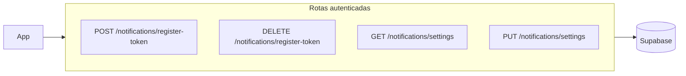

| Método | Rota | Descrição |
|--------|------|-----------|
| `POST` | `/api/notifications/register-token` | Registra/atualiza token Expo |
| `DELETE` | `/api/notifications/register-token` | Remove token (logout) |
| `GET` | `/api/notifications/settings` | Lê preferências |
| `PUT` | `/api/notifications/settings` | Salva preferências |

### Exemplos

**Registrar token:**
```http
POST /api/notifications/register-token
Authorization: Bearer <token>

{ "expo_push_token": "ExponentPushToken[xxxx]" }
```

**Salvar configurações:**
```http
PUT /api/notifications/settings
Authorization: Bearer <token>

{
  "enabled": true,
  "notify_hour": 9,
  "notify_minute": 0,
  "timezone": "America/Sao_Paulo"
}
```

---

## Configuração Firebase / Expo (Android)

Push no Android exige Firebase + credenciais no Expo.

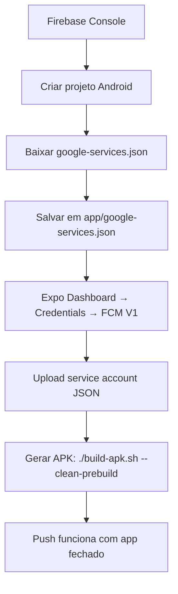

| Passo | Detalhe |
|-------|---------|
| Package Android | `com.mateus0110.lojajoias` |
| Expo Project ID | `bf241346-b604-4df1-972f-8c8fae3c9628` |
| Permissão Android | `POST_NOTIFICATIONS` em `app.json` |
| Canal Android | `customer-birthdays` — "Aniversários de clientes" |
| Service account JSON | **Não commitar** — ignorado pelo `.gitignore` |
| `google-services.json` | Pode ir pro Git (IDs públicos do app) |

Referência: `app/env-exemple` e `app/google-services.json.example`

---

## Segurança e performance

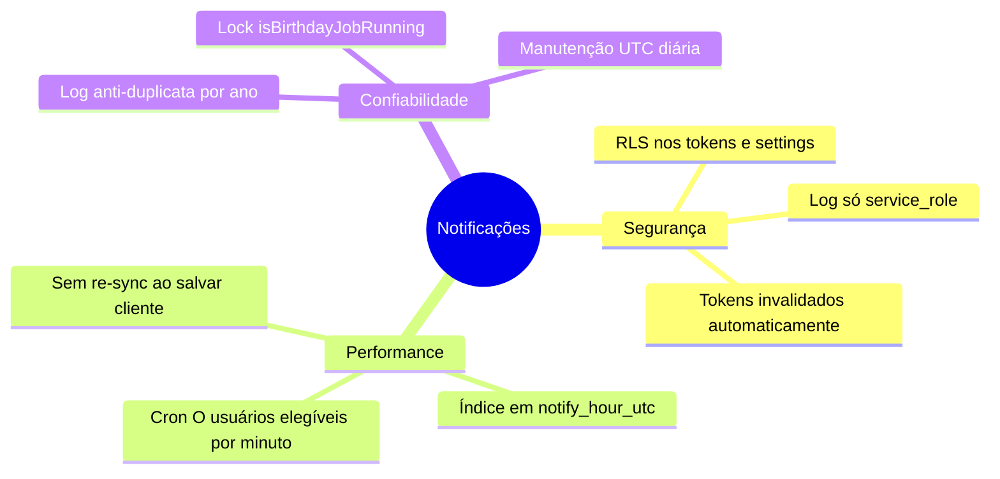

### Por que server-side push?

| Antes (local) | Agora (servidor) |
|---------------|------------------|
| App buscava todos os clientes | Backend consulta só aniversariantes do dia |
| Re-agendava N notificações a cada sync | Cron leve por minuto |
| Lento com muitos clientes | Escala no backend |

### Limpeza de tokens inválidos

Se o Expo retorna `DeviceNotRegistered`, o backend remove o token de `user_push_tokens` automaticamente.

---

## Referência de arquivos

| Área | Arquivo | Função |
|------|---------|--------|
| **Backend** | `backend/src/services/NotificationService.ts` | Tokens, settings, envio push, cron logic |
| **Backend** | `backend/src/jobs/birthdayNotificationCron.ts` | Cron minuto + manutenção UTC |
| **Backend** | `backend/src/routes/notificationRoutes.ts` | Rotas da API |
| **Backend** | `backend/src/bootstrap.ts` | Inicia cron na subida do servidor |
| **App** | `app/src/services/push-notifications.service.ts` | Permissões, token, enable/disable |
| **App** | `app/src/services/notification.service.ts` | Chamadas HTTP à API |
| **App** | `app/src/features/profile/components/profile-birthday-notifications-card.tsx` | UI no perfil |
| **App** | `app/src/features/notifications/components/push-token-registration.tsx` | Sync token ao logar |
| **App** | `app/src/features/notifications/components/notification-inbox-listener.tsx` | Captura push → inbox local |
| **App** | `app/src/app/(protected)/notifications.tsx` | Tela de recentes |
| **App** | `app/src/storage/recent-notifications.storage.ts` | Persistência local |
| **Shared** | `packages/shared/src/schemas/notification.schema.ts` | DTOs compartilhados |
| **DB** | `supabase/migrations/20260802150000_birthday_push_notifications.sql` | Migration |

---

## Ciclo de vida completo

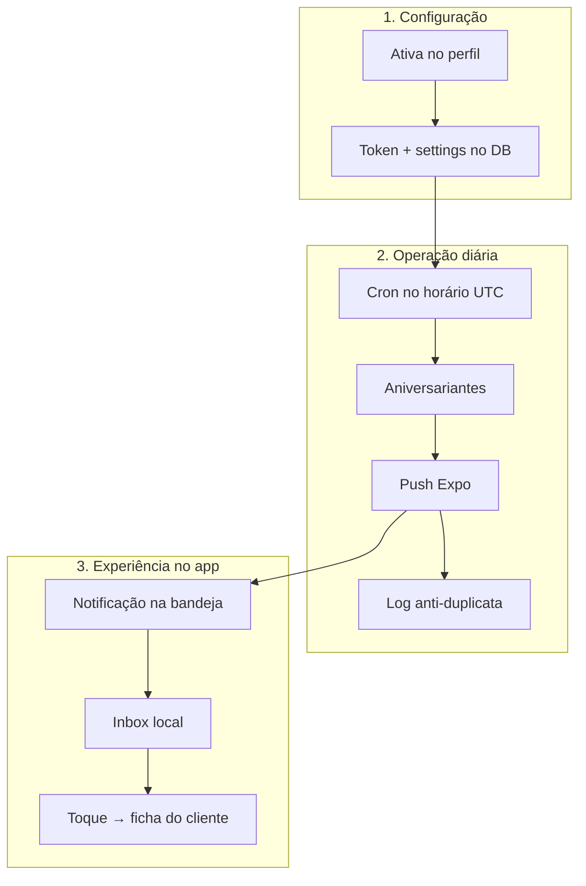

---

## Documentação relacionada

- [Fluxo de troca de senha](./README.md)
- [Backend — API Express](./BACKEND.md)
- [App — Expo / React Native](./APP.md)
